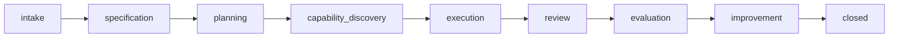

# claudius

A **governed multi-agent delivery framework for Claude Code**: reusable agents, MAS
workflow skills, policy files, templates, and a Python CLI for project lifecycle,
handoffs, shared state, and evaluation. It coordinates 16 specialized AI agents across
core, established, supervised, and infrastructure roles through formal protocols for
end-to-end project delivery.

For advanced Claude Code users who want a structured, auditable multi-agent workflow —
not a polished SaaS product. See [What's included / not included](#whats-included--not-included)
and [MVP limitations](#mvp-limitations).

---

## Table of Contents

- [What's included / not included](#whats-included--not-included)
- [MVP limitations](#mvp-limitations)
- [Quick Start](#quick-start)
- [Directory Structure](#directory-structure)
- [Multi-Agent System (MAS)](#multi-agent-system-mas)
  - [Agent Network](#agent-network)
  - [Project Lifecycle](#project-lifecycle)
  - [Core Modules](#core-modules)
  - [Governance](#governance)
  - [Shared State](#shared-state)
  - [Consultation System](#consultation-system)
  - [Communication Optimization](#communication-optimization)
  - [LLM Configuration](#llm-configuration)
- [Skills](#skills)
- [Commands](#commands)
- [CLI Reference](#cli-reference)
- [Testing](#testing)
- [Human Escalation Triggers](#human-escalation-triggers)
- [Adding New Agents or Skills](#adding-new-agents-or-skills)

---

## What's included / not included

**Included** in this public release:

- The MAS engine + Python CLI (`mas/core`, `mas/foundation`, `mas/policies`,
  `mas/templates`, `mas/roster`).
- 16 reusable agents (orchestration, intake/planning, evaluation/training, the
  consultant panel, and a generic delivery/QA agent).
- 11 skills — the 8 MAS workflow skills plus `graphify`, `skill-builder`, and
  `frontend-design` (see [`skills/README.md`](skills/README.md)).
- Engineering standards, CI, validators (`scripts/validate_agents.py`,
  `validate_skills.py`), a content privacy scanner, a `examples/demo_project`, and docs.

**Not included** (intentionally):

- Private project history, runtime state, or local databases (`mas/projects/`,
  `mas/data/`, logs are git-ignored and never shipped).
- Domain/personal skills (`research-extract`, `research-sync`) and the `notebooklm`
  skill, plus project-specific agents — kept out of the MVP core.
- Only a **fresh-install smoke test** ships (`mas/tests/test_smoke.py`); the full
  internal test suite stays in the development repo.
- No credentials. Bring your own `ANTHROPIC_API_KEY` (see `.env.example`); the CLI
  itself makes no API calls unless you run `mas run`.

## MVP limitations

This is a first public MVP (`v0.1.0`). Known limitations, deferred to later releases:

- **Single-node, file + SQLite state.** No distributed/tiered state, no multi-user
  deployment.
- **No distributed tracing, dead-letter queues, or circuit breakers.** Resilience is
  basic (checkpoints + resume).
- **Partial protocol support.** No full A2A; MCP/agent-to-agent interop is roadmap.
- **No PyPI release or plugin architecture yet.** Install from source.
- **Vector search remains optional and disabled by default.** The `vector` extra
  currently pins ChromaDB below 1.x because GHSA-f4j7-r4q5-qw2c has no fixed
  ChromaDB 1.x release yet.
- Autonomous `mas run` requires Anthropic credentials and is less battle-tested than
  the manual (Claude Code) workflow.

---

## Quick Start

### Prerequisites

- Python 3.11+
- [uv](https://docs.astral.sh/uv/) package manager
- Claude Code (VS Code extension)

### Setup (per machine)

```powershell
# Windows (PowerShell as Administrator)
.\setup.ps1

# macOS / Linux
./setup.sh
```

This creates symlinks so `agents/`, `commands/`, and `skills/` are globally available in Claude Code:

| Local Path | Symlink Target |
|------------|----------------|
| `agents/` | `~/.claude/agents/` |
| `commands/` | `~/.claude/commands/` |
| `skills/` | `~/.claude/skills/` |

### Install as a package (pip)

Prefer the CLI without cloning? Install the package and scaffold a workspace:

```bash
# Not yet on PyPI — install from the repo (or a built wheel):
pip install git+https://github.com/RicardoSantos0/claudius.git
# or:  pip install claudius-<version>-py3-none-any.whl

mas init-workspace          # copies agents/skills/policies/templates/roster into ~/.mas
mas doctor                  # verify the workspace (set MAS_HOME to use another dir)
mas init my-first-project
```

The distribution name is `claudius`, the CLI command is `mas`, and the workspace
defaults to `~/.mas` (override with `$MAS_HOME`). The wheel bundles the framework
files as package data and `mas init-workspace` copies them into the workspace, so
the CLI works without a clone. Running from a clone (source-tree mode, below) still
works unchanged.

### Run a MAS project

Activate the venv once per session (recommended — faster than `uv run`):

```bash
# Windows (run from the repo root)
.venv\Scripts\activate
# macOS / Linux
source .venv/bin/activate
```

Then use bare commands:

```bash
mas init quick-fix                  # Lite project (3 phases, no consultation) — DEFAULT
mas init --mode=standard big-effort # Standard project (9 phases, full governance)
mas doctor                          # Runtime diagnostics
mas status <project-id>             # Check project phase
mas resume <project-id>             # Resume guidance from checkpoint + state
mas rollup [--lineage]              # Cross-project summary / related-project families
mas sync                            # Reconcile manual-mode state into the queryable event store
mas roster                          # List all agents
pytest mas/tests/                   # Run test suite
```

`uv run mas ...` also works from repo root but is slower.

### Commit Discipline

Install the local hooks with `pre-commit install --hook-type pre-commit --hook-type commit-msg`.
Commit messages for tracked work must include `MAS: proj-YYYYMMDD-NNN-slug`.
The commit-msg hook verifies that the referenced local MAS project has governed
handoff trace, token accounting, and closed-project final artifacts. Use
`MAS-BYPASS: <rationale>` only when the user explicitly authorizes an emergency
out-of-band commit; CI still checks that direct pushes carry a MAS marker or an
explicit bypass record.

---

## Directory Structure

```
claude-config/
├── CLAUDE.md              # Agent instructions (loaded by Claude Code)
├── README.md              # This file
├── pyproject.toml         # Python package config (MAS)
├── setup.ps1              # Windows symlink setup (run as Admin)
├── setup.sh               # macOS/Linux symlink setup
│
├── agents/                # Custom Claude Code agents (16 MAS agents + utilities)
│   ├── master_orchestrator.md
│   ├── scribe_agent.md
│   ├── hr_agent.md
│   ├── inquirer_agent.md
│   ├── product_manager_agent.md
│   ├── project_manager_agent.md
│   ├── evaluator_agent.md
│   ├── trainer_agent.md
│   ├── spawner_agent.md
│   ├── risk_advisor.md
│   ├── quality_advisor.md
│   ├── devils_advocate.md
│   ├── domain_expert.md
│   ├── efficiency_advisor.md
│   ├── session_scheduler.md
│   ├── reliability_engineer.md
│   └── _utilities.md
│
├── commands/              # Custom slash commands
│   └── resume-mas.md      # Resume a paused MAS project
│
├── standards/             # Engineering standards (agent frontmatter, wire protocol, security, …)
│   ├── README.md
│   ├── agent-frontmatter.md
│   ├── commit-style.md
│   ├── documentation-format.md
│   ├── mas-governance.md
│   ├── mas-project-lifecycle.md
│   ├── python-standards.md
│   ├── security-and-permissions.md
│   ├── sql-conventions.md
│   └── wire-protocol.md
│
├── skills/                # Skill packages
│   ├── frontend-design/
│   ├── graphify/
│   ├── mas-clarify/       # MAS workflow: surface blocking questions
│   ├── mas-document/      # MAS workflow: update checkpoints and logs
│   ├── mas-examine/       # MAS workflow: analyze without modifying
│   ├── mas-handoff/       # MAS workflow: produce human-readable handoff
│   ├── mas-logwork/       # MAS workflow: track session work
│   ├── mas-plan/          # MAS workflow: produce or update execution plan
│   ├── mas-postmortem/    # MAS workflow: analyze failures and produce proposals
│   ├── mas-review/        # MAS workflow: review project state and next action
│   └── skill-builder/
│
└── mas/                   # Multi-Agent System engine
    ├── CLAUDE.md
    ├── system_config.yaml
    ├── core/              # Python engine
    │   ├── cli.py         # CLI entry point
    │   ├── db.py          # SQL access layer (SQLite fallback, PostgreSQL optional)
    │   └── engine/        # 20 engine modules
    ├── data/              # Runtime databases and local runtime state
    │   └── episodic.db    # Local SQLite fallback store
    ├── domains/           # Domain context files (auto-injected into domain_expert)
    ├── foundation/        # Protocol & schema specs
    ├── policies/          # 6 governance YAML files
    ├── projects/          # Project workspaces (gitignored)
    ├── roster/            # Agent registry + training_backlog.yaml
    ├── templates/         # Handoff, spawn, eval report templates
    └── tests/             # Test suite
```

---

## Multi-Agent System (MAS)

A governed multi-agent delivery framework that coordinates 16 specialized AI agents through formal handoff protocols, access-controlled shared state, and policy enforcement.

**Key dependencies**: `anthropic>=0.49.0`, `pyyaml>=6.0`, `python-dotenv>=1.0`, `click>=8.1`, `idna>=3.15`, `urllib3>=2.7.0` (optional extras: `psycopg` for Postgres, `chromadb>=0.5,<1.0.0` + `pydantic-settings>=2.14.2` for vector search)

The vector extra deliberately avoids ChromaDB 1.x until the upstream advisory
GHSA-f4j7-r4q5-qw2c has a fixed 1.x release. Keep vector storage disabled unless
you explicitly need it, and regenerate `uv.lock` after any dependency-policy change.

### Agent Network

16 active agents organized across T0, T1, T2, and an infrastructure lane:

The table below and `mas/roster/registry_index.yaml` are the canonical trust-tier sources.

```
┌─────────────────────────────────────────────────────────────────┐
│  T0 CORE (workflow control and governance)                      │
│  ┌──────────────────────┐  ┌──────────────┐                    │
│  │ master_orchestrator  │  │ scribe_agent │                    │
│  │ phases, delegation,  │  │ docs, audit, │                    │
│  │ policy decisions     │  │ checkpoints  │                    │
│  └──────────────────────┘  └──────────────┘                    │
├─────────────────────────────────────────────────────────────────┤
│  T1 ESTABLISHED (independent execution specialists)             │
│  hr_agent | inquirer_agent | product_manager_agent             │
│  project_manager_agent | evaluator_agent | trainer_agent       │
├─────────────────────────────────────────────────────────────────┤
│  T1 CONSULTANT PANEL (advisory · invoked for high-impact)       │
│  risk_advisor | quality_advisor | devils_advocate              │
│  domain_expert | efficiency_advisor                            │
├─────────────────────────────────────────────────────────────────┤
│  T1 DELIVERY (implementation and QA)                            │
│  reliability_engineer                                           │
├─────────────────────────────────────────────────────────────────┤
│  T2 SUPERVISED (require Master oversight)                       │
│  spawner_agent                                                  │
├─────────────────────────────────────────────────────────────────┤
│  INFRASTRUCTURE (session automation)                            │
│  session_scheduler                                              │
├─────────────────────────────────────────────────────────────────┤
│  T3 PROVISIONAL (sandbox · spawned agents, none currently)      │
└─────────────────────────────────────────────────────────────────┘
```

| Tier | Agent | Role |
|------|-------|------|
| **T0** | `master_orchestrator` | Overall coordination, governance, delegation, phase management, spawn approval |
| **T0** | `scribe_agent` | Documentation, record-keeping, decision logging, artifact tracking, audit trail |
| **T1** | `hr_agent` | Capability discovery, DeploymentPlan production, roster management, gap certification, agent registration |
| **T1** | `inquirer_agent` | Intake, requirements elicitation, clarification Q&A |
| **T1** | `product_manager_agent` | Product planning, MoSCoW prioritization, acceptance criteria, scope definition |
| **T1** | `project_manager_agent` | Execution planning, task decomposition, milestone tracking, dependency mapping |
| **T1** | `evaluator_agent` | Performance evaluation, metric scoring, pattern detection |
| **T1 Consultant** | `risk_advisor` | Risk analysis, failure mode analysis, mitigation planning, blast radius |
| **T1 Consultant** | `quality_advisor` | Quality review, completeness check, testability assessment |
| **T1 Consultant** | `devils_advocate` | Assumption challenging, alternative perspectives, blind spot detection |
| **T1 Consultant** | `domain_expert` | Domain knowledge, best practices, prior art (auto-injects from `mas/domains/`) |
| **T1 Consultant** | `efficiency_advisor` | Overengineering detection, cost estimation, simplification |
| **T1** | `trainer_agent` | Improvement proposals, pattern detection (L0 advisory only) |
| **Infrastructure** | `session_scheduler` | Scheduled session-resume, project lock management, cron-triggered checkpoint continuation |
| **T1** | `reliability_engineer` | Test suite (70% coverage gate), golden fixtures, CI lint guards, quality gates |
| **T2** | `spawner_agent` | Agent design, capability packaging, draft generation |

### Project Lifecycle

`mas init` defaults to **lite mode** (cheapest path that works); pass `--mode=standard`
to escalate to the full 9-phase governed pipeline for high-risk, multi-deliverable, or
ambiguous work.

**Standard mode** (`mas init --mode=standard <slug>`, 9 phases):



**Lite mode** (`mas init <slug>` — the default, 3 phases):

```
intake → execution → closed
```

Lite mode skips specification, planning, capability discovery, consultation, and review.
`mas status` shows `[lite]` next to the phase. Spawn is blocked in lite projects.

Each standard phase transition requires:
1. Exit criteria verification by Master
2. Shared state snapshot
3. Phase recording in state

**Project IDs** follow the format: `proj-{YYYYMMDD}-{NNN}-{slug}` (e.g., `proj-YYYYMMDD-NNN-session-scheduler`). Each project gets a standardized folder structure created by Scribe.

### Core Modules

**`mas/core/`** — top-level (always importable as `core.*`):

| Module | Purpose |
|--------|---------|
| `cli.py` | CLI entry point (`mas init` [lite default], `mas status`, `mas rollup`, `mas sync`, …) |
| `db.py` | Central SQL layer: `append_event`, `semantic_search`, `query_token_usage`, shared-state SQL helpers |
| `wire_protocol.py` | Compact wire format for handoff payloads |
| `config.py` | System configuration loader (reads `mas/system_config.yaml`) |

**`mas/data/`** — runtime database (gitignored, not exported):

| Module | Purpose |
|--------|---------|
| `episodic.db` | SQLite: agent events, FTS5 index, agents table (queryable projection of registry) |

**`mas/tools/`** — registry→DB sync and maintenance scripts:

| Module | Purpose |
|--------|---------|
| `roster_sync.py` | Sync `registry_canonical.yaml` → `episodic.db` agents table (idempotent upsert) |
| `capability_sync.py` | Sync agents + skills + commands → `episodic.db` |

**`mas/core/engine/`** — engine subpackage (import as `core.engine.*`):

| Module | Purpose |
|--------|---------|
| `shared_state_manager.py` | Project state, access control, snapshots |
| `handoff_engine.py` | Handoff creation, acceptance, SQL event logging |
| `access_control.py` | Field-level write permissions (updated 0.2.0 — broader write rights) |
| `prompt_assembler.py` | State projection + FTS5-aware prompt injection |
| `agent_runner.py` | Anthropic SDK wrapper; gated on `ANTHROPIC_API_KEY`; logs tokens |
| `consultation_engine.py` | Consultation lifecycle, synthesis, compact format |
| `intake_checker.py` | Spec quality scoring (threshold ≥ 0.85) |
| `capability_registry.py` | Roster, gap certificates, match scoring |
| `task_board.py` | Milestones, tasks, dependency chains |
| `metrics_engine.py` | Project + agent scoring; weights/thresholds sourced from `evaluation_policy.yaml`; advisory comms-efficiency dimension |
| `spawn_policy.py` | Spawn validation; `LITE_MODE_NO_SPAWN` for lite projects |
| `training_engine.py` | Proposal generation, backlog management |
| `skill_bridge.py` | Agent-to-skill gateway with authorization matrix (injectable `projects_root` for test isolation) |
| `cross_project.py` | Cross-project rollup + lineage families + `find_predecessor` (powers `mas rollup`, lineage→reuse) |
| `state_reconciler.py` | Reconcile manual-mode `shared_state.yaml` into queryable `agent_events` (powers `mas sync`; idempotent) |
| `graph_memory.py` | Legacy graph helper still present for migration/compatibility work |
| `audit_logger.py` | Structured YAML event logging |
| `checkpoint_writer.py` | Human-readable project checkpoints |
| `context_compressor.py` | Progressive state compression for token budgets |
| `message_bus.py` | Inter-agent messaging |

### Governance

Six YAML policy files in `mas/policies/` enforce all system rules:

| Policy | Key Rules |
|--------|-----------|
| **governance_policy.yaml** | Reuse before create · document before forget · improve only through evidence · violations blocked pre-execution · 3 violations → human escalation |
| **handoff_protocol.yaml** | Structured handoff records (identity, parties, context, payload, acceptance status) |
| **trust_tier_policy.yaml** | 4 tiers (T0–T3) with promotion requirements: evaluator verification + zero violations + human approval |
| **spawn_policy.yaml** | Gap cert + Master approval + consultant review · max 3/project · max 1/phase · no recursive spawning |
| **evaluation_policy.yaml** | Metrics: goal achievement, acceptance pass rate, handoff acceptance, doc completeness, boundary violations · Probation <60, Exemplary >90 |
| **training_policy.yaml** | L0 advisory → L1 supervised → L2 autonomous · proposals need ≥1 evaluation report |

#### Trust Tier Promotions

- **T3 → T1**: Evaluator verification + zero governance violations + human approval
- **Trainer L0 → L1**: 3 successful projects + human review + zero violations
- **Trainer L1 → L2**: 5 successful L1 cycles + human approval

### Shared State

Each project has a single source of truth (`shared_state.yaml`) with access-controlled sections:

| Section | Contents |
|---------|----------|
| `core_identity` | project_id, phase, status (immutable after creation) |
| `project_definition` | brief, spec, goal, scope, constraints, success/acceptance criteria, risk classification |
| `workflow` | active agents, completed phases, handoff history, resource requests |
| `decisions` | decision log, assumptions, open questions, approvals, policy flags |
| `capability` | available skills, gap certificates, spawn requests |
| `artifacts` | documents, deliverables, change log |
| `evaluation` | performance metrics, quality findings, improvement proposals |
| `communication` | token tracking, wire compliance counters |
| `consultation` | consultation requests and responses |
| `execution` | tasks and milestones |

All fields have `set_by` (owner), `mutability` rules, and type definitions. **No agent may write to fields it doesn't own.**

### Consultation System

The 5-member consultant panel: `risk_advisor`, `quality_advisor`, `devils_advocate`, `domain_expert`, `efficiency_advisor`.

**Master decides the panel composition** — the engine adds no defaults. Master specifies which consultants to invoke via `consultation_trigger.consultants` in its wire response. Typical selections:

| Decision type | Consultants |
|---------------|-------------|
| Architecture / technical | `domain_expert`, `risk_advisor`, `quality_advisor` |
| Scope / governance | `risk_advisor`, `devils_advocate`, `efficiency_advisor` |
| Critical / high-stakes | All five |

**Hard stop**: If all invoked consultants return "high" risk → human escalation required. Master cannot override unanimous high-risk without human approval.

### Communication Optimization

- **Compact wire format**: `HandoffEngine.compact()`/`expand()`, `ConsultationEngine.compact_request()`/`expand_request()`
- **Token counter**: Heuristic and tiktoken backends
- **Wire protocol validation** for payload compliance
- **Skill bridge** with per-agent access control matrix
- **SQL-backed context lookups** with SQLite as the local fallback and PostgreSQL/ChromaDB available when configured
- **Communication efficiency metrics** in evaluation (half-weight): token efficiency, payload density, context injection efficiency, consultation overhead, wire compliance

### Memory and Episodic DB

**Three-tier memory:**

| Type | Scope | Lifetime | Store |
|------|-------|----------|-------|
| Working state | Task/phase | Ephemeral | `shared_state.yaml` (archived at phase end) |
| Episodic (events) | Per project | Durable | SQL backend (`mas/data/episodic.db` locally, PostgreSQL when configured) |
| Roster | System-wide | Durable | `mas/roster/` YAML files |

The runtime uses a SQL event store:

- Every handoff create/accept/reject writes a row
- Every live `agent_runner` call writes a row
- SQLite uses FTS5 locally; PostgreSQL uses a simple SQL text match until a richer search backend is configured
- `core.db.semantic_search(query, project_id)` — SQL-backed event search
- `core.db.query_token_usage(project_id)` — sums `tokens_prompt/completion/total`
- `prompt_assembler` injects the 5 most relevant past events into every agent prompt
  (uses semantic search with current phase as query; falls back to recent-5 if < 2 hits)

### LLM Configuration

| Agent | Model | Max Tokens | Temperature |
|-------|-------|------------|-------------|
| `master_orchestrator` | `claude-opus-4-7` | 4096 | 0.3 |
| `efficiency_advisor` | `claude-haiku-4-5` | 4096 | 0.3 |
| All others | `claude-sonnet-4-6` | 4096 | 0.3 |

Model selection is canonical in `mas/system_config.yaml` (llm block) and per-agent in `mas/roster/registry_canonical.yaml`. Override at runtime via `MAS_MASTER_MODEL` / `MAS_DEFAULT_MODEL` env vars.

### Domain Contexts

Markdown files in `mas/domains/` auto-injected into `domain_expert`:

- `software_engineering.md`
- `data_science.md`
- `content_creation.md`
- `research.md`

---

## Skills

### MAS Workflow Skills

These skills provide ergonomic session workflows over MAS governance state. They wrap MAS concepts without replacing them.

| Skill | Trigger | Description |
|-------|---------|-------------|
| `mas-review` | Start/resume a session | Review MAS project state, pending handoffs, risks, and recommended next action |
| `mas-plan` | Need a phase-aware plan | Produce or update an execution plan from project state and objectives |
| `mas-clarify` | Ambiguity blocks work | Surface and prioritize blocking questions; propose safe assumptions |
| `mas-examine` | Need to analyze before acting | Analyze code, docs, state, policies, or architecture without modifying anything |
| `mas-document` | Completing a phase or session | Update checkpoints, decision logs, artifact indexes, and progress summaries |
| `mas-handoff` | Ending a session or handing off | Produce a human-readable handoff from MAS state (session, PR, agent, incident) |
| `mas-logwork` | Track session work | Record start/stop/pause/resume and feed work context into MAS evaluation |
| `mas-postmortem` | After a failure or violation | Analyze root causes and produce action items and training proposals |

### Other Skills

| Skill | Description |
|-------|-------------|
| `graphify` | Turn any folder into a navigable knowledge graph (community detection, query/path/explain) |
| `skill-builder` | Create, optimize, or audit skills against Claude Code best practices |
| `frontend-design` | Distinctive, production-grade frontend interfaces |

---

## Commands

| Command | Description |
|---------|-------------|
| `resume-mas` | Resume a paused MAS project from its checkpoint |

---

## CLI Reference

Activate the venv first (`...\.venv\Scripts\activate`), then:

```bash
mas init <slug>                  # Initialize lite project (3 phases) — DEFAULT
mas init --mode=standard <slug>  # Initialize standard project (9 phases, full governance)
mas doctor                       # Runtime/env diagnostics (DB, vector, templates, API key)
mas status <project-id>          # Current phase [lite], owner, pending handoffs
mas resume <project-id>          # Resume summary + next action
mas pending <project-id>         # Unresolved handoffs
mas snapshot <project-id>        # Snapshot state at current phase
mas rollup [--lineage]           # Cross-project summary; --lineage groups related families
mas sync [--dry-run]             # Reconcile manual-mode project state into agent_events
mas roster                       # All registered agents
```

Or via `uv run mas <command>` from repo root (slower).

---

## Testing

This release ships a **fresh-install smoke suite** that verifies a clean install end to
end (imports, `mas doctor`, and an `init → status → prompt` round-trip):

```bash
pytest mas/tests/              # smoke suite (test_smoke.py)
```

Also run the validators (the same checks CI runs):

```bash
python scripts/validate_agents.py     # agent frontmatter + registry coverage
python scripts/validate_skills.py     # skill SKILL.md validity + registry consistency
```

> The full internal development test suite (1400+ tests across unit/integration/
> governance/prompts) lives in the upstream development repo; only the smoke suite is
> shipped here.

### Further documentation

- [docs/architecture.md](docs/architecture.md) — component & lifecycle map
- [docs/operation-modes.md](docs/operation-modes.md) — Claude Code config mode vs source-tree MAS mode
- [docs/authoring-agents.md](docs/authoring-agents.md) — add/update an agent without breaking registry invariants
- [docs/authoring-skills.md](docs/authoring-skills.md) — add/register/validate a skill
- [docs/release-checklist.md](docs/release-checklist.md) — pre-release validators, tests, smoke checks
- [docs/publishing.md](docs/publishing.md) — build, verify, and publish the pip package to PyPI

> **Packaging:** claudius is a **pip-installable package** (distribution `claudius`, CLI `mas`, import root `core`). The wheel bundles the framework files (agents, skills, policies, templates, roster, foundation, domains, system config) as package data; `mas init-workspace` copies them into a writable workspace (`$MAS_HOME`, default `~/.mas`). It is **not yet on PyPI** — install from the repo or a built wheel (see [Install as a package](#install-as-a-package)). Running from a clone (source-tree mode) also works unchanged, resolving runtime data from the repo.

---

## Human Escalation Triggers

The system forces human intervention when:

- Risk classification is "critical"
- Unresolvable consultant concern
- Two consecutive spawn denials
- Phase blocked after retry
- Unanimous high-risk from all 5 consultants
- Master needs to override unanimous recommendation
- Trust tier promotion, governance policy change, or trainer promotion

---

## Adding New Agents or Skills

- **Agent**: Create `agents/{name}.md` with frontmatter (`name`, `description`, `tools`)
- **Skill**: Create `skills/{name}/SKILL.md`
- **Command**: Create `commands/{name}.md`

---

## Sharing / Exporting This Repo

**Do not zip the working tree directly.**

The working tree may contain runtime state, local Claude permissions, browser state,
databases, logs, or credentials that must not be shared.

Use the source-only export scripts instead:

```bash
# Bash / macOS / Linux
scripts/export_source.sh
python scripts/check_archive_clean.py claude-config-source.zip

# PowerShell / Windows
.\scripts\export_source.ps1
python scripts/check_archive_clean.py claude-config-source.zip
```

The export scripts use `git archive` which only includes tracked source files and
honours `.gitattributes` export-ignore rules. The scanner will fail with a non-zero
exit code if any blocked path (`.env`, `.venv/`, `mas/projects/`, browser state, etc.)
is present in the archive.
- Push to GitHub — other machines pull to sync
